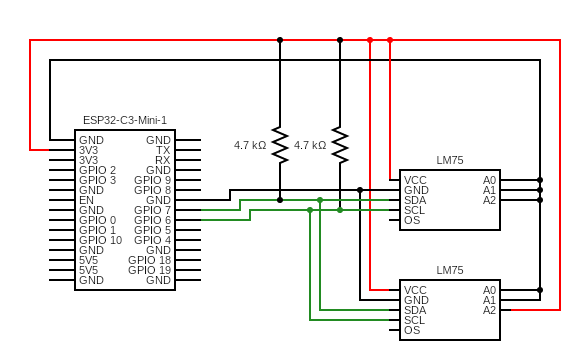

# ESP32 Temperature Sensor
This project is aimed to learn more about I2C communication, writing drivers and using the MQTT protocol over WiFi to publish temperature information.

## Highlights
* LM75A driver made to support several devices on the same I2C bus.
* Separation of bus-creating and adding devices to the bus.
* Opaque pointers to an internal struct
* MQTT communication with a local server

## Overview
This project contains the following include files:
* config.h - used for defining your wifi and mqtt credentials.
* i2c_utils.h - initiation of i2c bus and R/W functions.
* LM75A_driver.h - initiation of devices and temperature read function.

The project is based on the ESP32-C3-Mini, but with some changes will fit any ESP with a wifi interface and correctly connected LM75A. I've chosen to work with FreeRTOS to learn more about how error-handling, semaphores and using tasks works.

This is written as a learning experience from a student and should not be judged as production code.

## Pre-requisites
To be able to run this project you need the following:

### GCC
Compiler for C. Needed to build the projects binary files before creating .hex and .elf files.

### ESP-IDF
Espressif IoT Development Framework. Needed to build and flash files to device.

### CH340C Driver
Driver for the serial communication between the device and your computer using the USB-connection.

### ESP32
A microcontroller to perform the tasks from the program.

### LM75A
A temperature reader matching the model used in this program.

### Circuit Drawing


## How to use

### 1. Configure project
Open up the project in a code editor and change the following settings to what fits your project:

**LM75A_driver.h**  
Here you configure everything regarding the temperature sensors used in your system. The LM75A has enough addresses to support 8 different devices on the same I2C connection.
```c
#define TEMPERATURE_UNIT 0            // Set to 1 for Fahrenheit or 0 for Celsius
#define READING_INTERVAL_MS 1000      // Set interval in MS for reading temperature 

#define LM75A_UNIT_ADDRESSES          {0x48}                // Array of addresses used on the I2C bus. Add your addresses here
#define LM75A_AMOUNT_OF_UNITS         1                     // How many units are connected to the I2C bus
#define LM75A_UNIT_ADDRESS_LENGTH     I2C_ADDR_BIT_LEN_7    // Address length - Either I2C_ADDR_BIT_LEN_7 or I2C_ADDR_BIT_LEN_10
#define LM75A_DATA_LENGTH             2                     // Defines the number of integers needed for the buffer when communicating
```
  
**i2c_utils.h**  
Here you configure the I2C connection to fit your needs. Remember that using a higher frequency might require you to use lower resistance for the pull-up drain.
```c
#define MASTER_SDA_PIN          GPIO_NUM_7      // GPIO for SDA
#define MASTER_SCL_PIN          GPIO_NUM_6      // GPIO for SCL
#define MASTER_I2C_PORT         I2C_NUM_0       // ESP32 Internal I2C module
#define MASTER_FREQUENCY        100000          // Unit: Hz
#define MASTER_TX_BUF_DISABLE   0
#define MASTER_RX_BUF_DISABLE   0
#define MASTER_TIMEOUT_MS       1000

#define MAX_AMOUNT_OF_TRIES     3
#define WAIT_FOR_MUTEX_MS       50
```

### 2. Build project
Navigate to this folder on your computer in the ESP-IDF CMD shell and use this command `idf.py build`

### 3. Flash to device
Using the device manager - locate which COM port your ESP32 is connected to and use this to flash your device. In this example I use COM3. `idf.py -p COM3 flash monitor`

You will now be able to the see the logging messages on your screen.

## About the author
My name is Carl. I am currently studying IoT and Embedded Development. I develop projects on my free time to apply and enrichen the things I learn at school.

If you have any questions regarding this or any of my other projects, feel free to reach out!